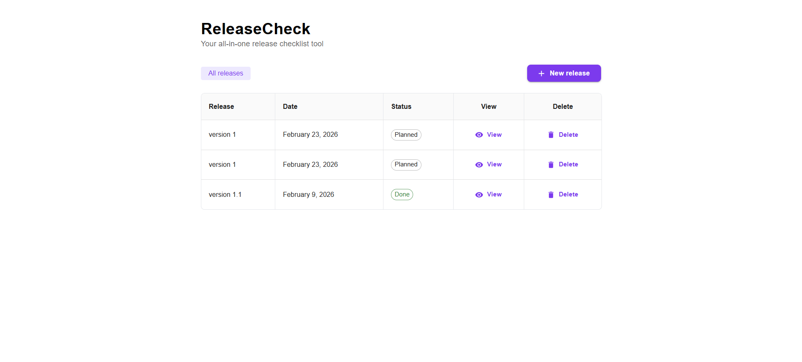
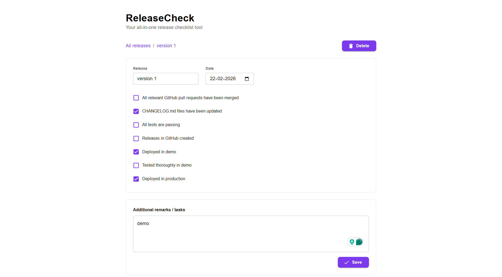

# ReleaseCheck ✅

A full-stack release checklist application to track and manage software releases. Built with React, Redux Toolkit, Material UI on the frontend and Express, TypeScript, PostgreSQL on the backend.

---

## Screenshots

### Release List Page

<!-- Add your screenshot below -->


### Release Detail Page

<!-- Add your screenshot below -->


### Create Release Dialog

<!-- Add your screenshot below -->


---

## Tech Stack

### Frontend
- **React 19** with TypeScript
- **Vite** — fast dev server & build tool
- **Redux Toolkit** — state management
- **Material UI (MUI)** — component library
- **React Router** — client-side routing

### Backend
- **Express 5** with TypeScript
- **PostgreSQL** (Neon) — database
- **pg** — PostgreSQL client
- **ts-node-dev** — auto-reloading dev server

---

## Getting Started

### Prerequisites

- **Node.js** v18+
- **PostgreSQL** database (or a Neon connection string)

### 1. Clone the repository

```bash
git clone <your-repo-url>
cd full-stack-22-feb
```

### 2. Backend Setup

```bash
cd backend
npm install
```

Create a `.env` file in the `backend/` directory:

```env
DATABASE_URL=your_postgresql_connection_string
PORT=5000
```

Start the backend server:

```bash
npx ts-node-dev index.ts
```

The API will be running at `http://localhost:5000`.

### 3. Frontend Setup

```bash
cd frontend
npm install
npm run dev
```

The app will be running at `http://localhost:5173`.

---

## API Endpoints

| Method   | Endpoint              | Description              |
|----------|-----------------------|--------------------------|
| `GET`    | `/api/releases`       | Fetch all releases       |
| `POST`   | `/api/releases`       | Create a new release     |
| `PATCH`  | `/api/releases/:id`   | Update a release         |
| `DELETE` | `/api/releases/:id`   | Delete a release         |

---

## Project Structure

```
full-stack-22-feb/
├── backend/
│   ├── config/         # Database connection
│   ├── controllers/    # Route handlers
│   ├── models/         # Database queries
│   ├── routes/         # Express routes
│   ├── utils/          # Helper functions (status computation)
│   ├── index.ts        # Entry point
│   └── tsconfig.json
├── frontend/
│   ├── src/
│   │   ├── components/ # Reusable components (Icons)
│   │   ├── pages/      # ReleaseListPage, ReleaseDetailPage
│   │   ├── redux/      # Store, slices, hooks
│   │   ├── routes/     # React Router config
│   │   ├── App.tsx
│   │   └── main.tsx
│   └── tsconfig.json
├── screenshots/        # Add your screenshots here
└── README.md
```

---

## Database Schema

```sql
CREATE TABLE releases (
  id UUID PRIMARY KEY DEFAULT gen_random_uuid(),
  name VARCHAR(255) NOT NULL,
  release_date DATE NOT NULL,
  status VARCHAR(50) DEFAULT 'planned',
  steps BOOLEAN[] DEFAULT '{false,false,false,false,false,false,false}',
  additional_info TEXT,
  created_at TIMESTAMP DEFAULT NOW()
);
```